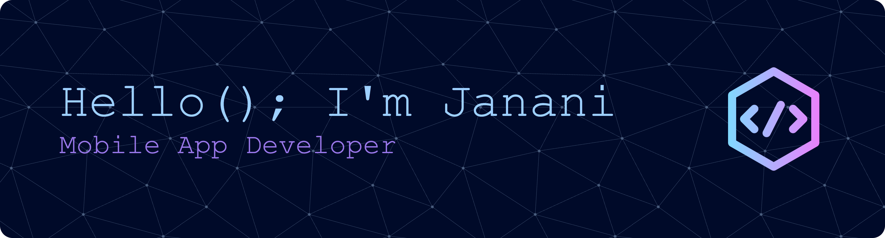

### Mobile Application Developer | React Native

---

## 👩‍💻 About Me

I’m a **Mobile Application Developer** with **1+ year of industry experience**, specializing in **React Native** and cross-platform mobile app development.  
I enjoy building **scalable, production-ready apps** with clean architecture, strong performance, and great user experience.

- 🎓 BSc (Hons) in Software Engineering – **SLIIT**
- 💼 **Associate Software Engineer (Mobile – React Native)** at **WebAppClouds**
- 💼 **React Native Developer (Freelancing)** at **LilyLanka**
- 🌱 Passionate about mobile architecture, performance optimization & clean code
- 🌐 Portfolio: [janani-withana-portfolio.vercel.app](https://janani-withana-portfolio.vercel.app)
  
---
## Mobile
<code></code>
<code></code>
<code></code>
<code></code>

## Languages
<code></code>
<code></code>
<code></code>
<code></code>
<code></code>

## Backend & Cloud 
<code></code>
<code></code>
<code></code>

## Web
<code></code>
<code></code>
<code></code>
<code></code>

## Tools
<code></code>
<code></code>
<code></code>
<code></code>

 
<!--
<!-- -->
<!---->
<!--  -->

<!--
**it21271328/it21271328** is a ✨ _special_ ✨ repository because its `README.md` (this file) appears on your GitHub profile.

Here are some ideas to get you started:

- 🔭 I’m currently working on ...
- 🌱 I’m currently learning ...
- 👯 I’m looking to collaborate on ...
- 🤔 I’m looking for help with ...
- 💬 Ask me about ...
- 📫 How to reach me: ...
- 😄 Pronouns: ...
- ⚡ Fun fact: ...
-->
